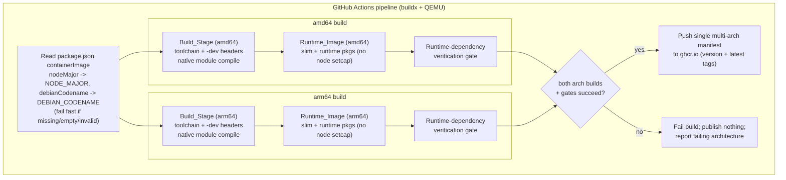
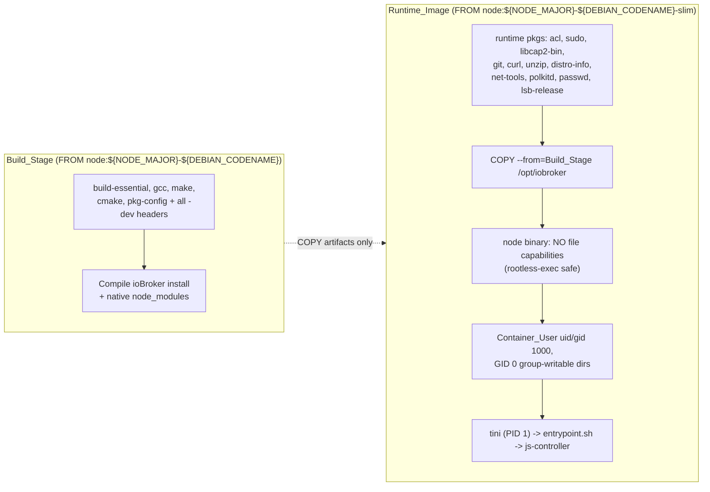
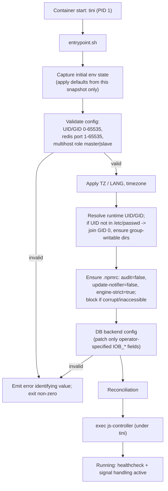
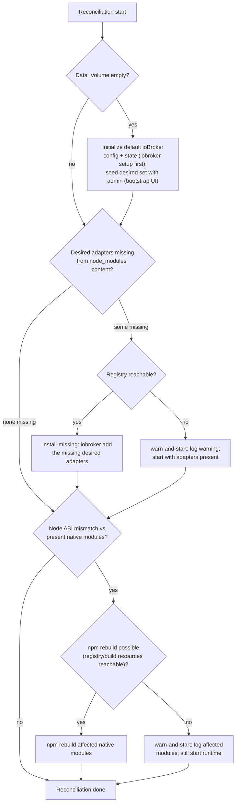
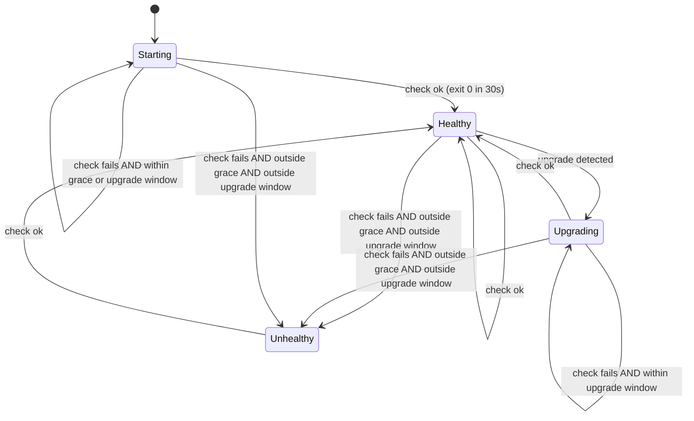

# Design Document

## Overview

This design modernizes the ioBroker Docker image (reference: `buanet/ioBroker.docker`) into a **rootless, multi-architecture** container image published to `ghcr.io` under the name `ghcr.io/fernetmenta/iobroker` (intentionally distinct from the source repository name `ioBroker.container-image`). It replaces the monolithic ~1.6 GB image with a slim, multi-stage build on the official Node.js 22 LTS ("jod") base, produces a single multi-arch manifest (amd64 + arm64), and runs as an unprivileged, UID/GID-overridable user across Docker, Podman, and k3s.

The design is organized around four cooperating concerns:

1. **Build-time** — a two-stage Dockerfile (`Build_Stage` → `Runtime_Image`), Node major version and Debian codename read from the maintainer-owned Build_Config (`package.json` `containerImage` key), native compilation of modules, a runtime-dependency verification gate, and file capabilities applied to the Node binary. Orchestrated by a GitHub Actions multi-arch pipeline that publishes all-or-nothing. (Req 1, 2, 5, 7)
2. **Runtime user model** — a non-root `Container_User` (default UID/GID 1000), overridable UID/GID, and OpenShift-style arbitrary-UID support via GID 0 group membership and group-writable directories. (Req 3, 4)
3. **Entrypoint + reconciliation** — an `Init_Process` as PID 1 (tini) with correct signal handling and zombie reaping, wrapping an entrypoint that validates configuration, applies npm settings and objects/states database-backend settings, reconciles the adapter set against the `Data_Volume`, and `exec`s js-controller. (Req 6, 8, 10, 11, 12, 13, 14)
4. **Operational surface** — an upgrade-tolerant `Healthcheck_Mechanism` usable by both Docker `HEALTHCHECK` and Kubernetes probes, a reduced persistence layout, and preserved ioBroker installer behaviors. (Req 8, 9)

Where a design decision satisfies a specific acceptance criterion, the requirement number is referenced inline as **(Req N)** or **(Req N.M)**.

### Design Principles

- **Runtime success over size** — size reduction stops where it would break the `Iobroker_Runtime`. A runtime-dependency gate fails the build rather than ship a broken image. (Req 2.8, 2.7)
- **Rootless by default, escalation only for explicit maintenance** — normal operation never uses setuid or sudo; a narrowly scoped diagnostic exception is the only permitted escalation. (Req 3.6, 3.8)
- **`Data_Volume` is the source of truth** — installed adapter code (`node_modules`) is reconciled to match what the `Data_Volume` records, never the reverse. (Req 8.5)
- **Idempotent configuration** — database-backend and reconciliation logic re-apply only when inputs change, so restarts are stable. (Req 12.7, 12.8)

## Architecture

### Build-time / Runtime layering



The Dockerfile uses a multi-stage build so the `Runtime_Image` is derived **exclusively** from the final stage and contains no compiler toolchain or `-dev` headers. (Req 2.2, 2.3, 2.4)



### Base image choice: `node:${NODE_MAJOR}-${DEBIAN_CODENAME}-slim` (default codename `trixie`)

The official Node.js image ships Debian-release-keyed tags for each Node LTS line (e.g. `${NODE_MAJOR}-trixie-slim`, `${NODE_MAJOR}-bookworm-slim`). The Debian release is selected by the `DEBIAN_CODENAME` build arg (default `trixie`). (Req 2.1) Candidate runtime bases and trade-offs (codename shown as `${codename}`):

| Base variant | Size | Native module support | Verdict |
|---|---|---|---|
| `node:${NODE_MAJOR}-${codename}` (full) | Largest (~1 GB base) | Complete; ships toolchain | Rejected for runtime — defeats the size goal; toolchain not needed at runtime (Req 2.3). Used for the Build_Stage. |
| `node:${NODE_MAJOR}-${codename}-slim` | Small Debian userland | glibc + apt available; runtime shared libs (`libcairo2`, `libpango`, `librsvg2`, `libavahi-compat-libdnssd1`, etc.) installable via apt | **Selected** |
| `node:${NODE_MAJOR}-alpine` | Smallest | musl libc; many ioBroker native modules and the installer assume glibc/Debian; `apt`/`distro-info`/`lsb-release` unavailable | Rejected — installer_library and adapters expect a Debian/glibc userland |

**Decision:** base the `Runtime_Image` on `node:${NODE_MAJOR}-${DEBIAN_CODENAME}-slim`. The Debian release is a build arg, `DEBIAN_CODENAME`, defaulting to **`trixie`** (current Debian stable, Debian 13); `bookworm` (oldstable) remains available via `--build-arg DEBIAN_CODENAME=bookworm`. Combined with the bundled-content policy below, the slim base gives a meaningfully smaller image than the ~1.8 GB reference — measured ~0.92 GB on trixie (Req 2.5) — while retaining glibc and apt so the runtime shared libraries the ioBroker installer expects can be added, keeping the `Iobroker_Runtime` functional (Req 2.6, 2.8). The `Build_Stage` uses the full `node:${NODE_MAJOR}-${DEBIAN_CODENAME}` with the SAME `NODE_MAJOR` and `DEBIAN_CODENAME`, so both stages share the same glibc/ABI, ensuring natively compiled modules copied forward are binary-compatible. Parameterizing the codename (rather than hardcoding a tag in each `FROM`) keeps the base a single source of truth and makes a future Debian bump a one-line change. (Req 2.1, 2.2)

Runtime shared libraries corresponding to the build-time `-dev` headers (e.g. `libcairo2`, `libpango-1.0-0`, `librsvg2-2`, `libpixman-1-0`, `libjpeg62-turbo`, `libgif7`, `libudev1`, `libpam0g`, `libavahi-compat-libdnssd1`) are installed in the `Runtime_Image` so the compiled native modules load at runtime; only the `-dev` headers and compilers are excluded. (Req 2.3, 2.4, 5.3)

### Bundled content policy (image size)

**Decision: the image bundles only the ioBroker `js-controller`; it does NOT bundle any adapters.**

Rationale — bundled adapters are dead weight in every normal scenario:

- **Fresh install (online):** Reconciliation installs the adapters recorded in the `Data_Volume` from the registry, so bundled adapter code is overwritten/redundant. Fresh installs have internet by definition.
- **Image update, `node_modules` not persisted:** Reconciliation reinstalls the recorded adapter set from the registry; bundled code is ignored.
- **Image update, `node_modules` persisted (mounted volume):** the present content already holds the adapters, so reconciliation installs nothing (content-based convergence).

The only scenario bundled adapters would help is a first boot with no internet — which is not a supported/normal case. `js-controller` itself MUST stay bundled: it is the bootstrap (the `iobroker` CLI that reconciliation uses to install adapters lives in js-controller), it is already compiled against the shipped Node ABI, and reconciliation never reinstalls it.

Stripping the previously-bundled default adapters (`admin`, `discovery`, `backitup`) and their (large) dependency trees reduces the shipped image from ~1.39 GB to ~0.95 GB (layer-sum), roughly half of the ~1.8 GB reference image — measured, amd64. The remaining `node_modules` (~177 MB) is js-controller and its runtime deps (including the `@iobroker/plugin-sentry` telemetry plugin, retained as a js-controller dependency).

**First-run behavior change (documented tradeoff):** with a fresh `Data_Volume` and the registry reachable, reconciliation installs the recorded adapter set (including `admin`) on first start; a first boot with the registry unreachable will have no admin UI until connectivity is restored. This is consistent with the `Data_Volume`-is-source-of-truth principle (Req 8.5) and the offline-start handling (Req 8.11: start without failing when the registry is unreachable).

**Native adapters without prebuilt binaries (escape hatch):** the `Runtime_Image` deliberately ships no compiler toolchain (Req 2.3), so an adapter with native code and no prebuilt binary for the target architecture cannot be compiled at runtime install. This risk already exists for any adapter a user's `Data_Volume` records beyond what was bundled; stripping the defaults simply routes `admin`/`discovery`/`backitup` through the same runtime-install path. Operators who need such adapters build a derived image, e.g.:

```dockerfile
FROM ghcr.io/<owner>/iobroker:latest
USER root
RUN apt-get update && apt-get install --no-install-recommends -y \
        build-essential python3 pkg-config \
    && rm -rf /var/lib/apt/lists/*
USER 1000
```

This keeps the default image slim and rootless while giving users who need a build toolchain an explicit, reproducible, build-time path (no runtime `apt`/root, preserving Req 3.6). This is documented rather than provided as a runtime env var.

### CI/CD pipeline shape (GitHub Actions)

- A single workflow uses `docker/setup-qemu-action` + `docker/setup-buildx-action` to enable cross-architecture builds. (Req 1.1, 1.2)
- `NODE_MAJOR` is derived once from the `nodeMajor` field and `DEBIAN_CODENAME` from the `debianCodename` field of the `package.json` `containerImage` Build_Config, both passed as build args to both architecture builds; if either field is missing/empty/invalid the workflow fails before any build step. (Req 5.4, 5.5, 5.7)
- `docker/build-push-action` builds `--platform linux/amd64,linux/arm64`. The runtime-dependency gate runs as a build stage (`RUN` step) inside each arch build so a missing runtime dependency fails that arch. (Req 2.6, 2.7)
- **Published image name:** the image is published as `ghcr.io/fernetmenta/iobroker` — the GitHub owner namespace plus the package name `iobroker`. This name is set **explicitly** as the `images:` value of the `docker/build-push-action` (metadata/build-push) step rather than being derived from `github.repository`. GHCR permits the package name to differ from the repository name; deriving from `github.repository` would instead yield `ghcr.io/fernetmenta/iobroker.container-image` (matching the source repo `ioBroker.container-image`), which is intentionally **not** used. GHCR package names must be lowercase, so `ioBroker` normalizes to `iobroker`. (Req 1.3)
- **Package-to-repo linkage:** because the package name (`iobroker`) differs from the source repository name (`ioBroker.container-image`), the package is linked back to its source via the OCI label `org.opencontainers.image.source`, already set by the Dockerfile OCI labels. This label MUST point at the `ioBroker.container-image` repository so the GHCR package links correctly to its source. (Req 1.3)
- Publication is a single `buildx` push that emits **one manifest list** for `ghcr.io/fernetmenta/iobroker`, referencing both arch variants under a shared immutable version tag and `latest` (both tags applied to the same single multi-arch manifest). Because buildx pushes the manifest only after both platform builds complete, no single-arch image is ever published; if either arch fails the push does not happen and the log identifies the failed platform. (Req 1.3, 1.6, 1.8)
- The registry (ghcr.io) then serves the matching variant of `ghcr.io/fernetmenta/iobroker` per client architecture and rejects unsupported architectures with a "no matching manifest" error — standard OCI manifest-list behavior, not custom logic. (Req 1.4, 1.5, 1.7)

**Workflow triggers and versioning:**

- **Publish path (tag pushes only):** the push/publish path runs **only** on a pushed git tag matching `v*` (e.g. `v1.2.3`). The pushed git tag is the source of the image version: the leading `v` is stripped (or consumed per `docker/metadata-action` semver semantics) to form the immutable image version tag applied to `ghcr.io/fernetmenta/iobroker`, alongside `latest`. No publish occurs on branch pushes. (Req 1.3, 1.6, 1.8)
- **Build-only path (PRs and `main`):** on pull requests and on pushes to `main`, the workflow runs **build-only** (no push) for CI validation — it still builds both architectures and runs the runtime-dependency verification gate, but does not push to ghcr.io. (Req 1.1, 1.2, 2.6, 2.7)
- **Manual dry-run:** a `workflow_dispatch` trigger is supported for an on-demand dry-run build with no publish.
- **Tag/label computation and push gate:** use `docker/metadata-action` to compute tags/labels from the git ref — semver tags derived from `v*` tag pushes, and the `org.opencontainers.image.source` label set to the source repo (`ioBroker.container-image`). The push is gated on the git ref so only tag pushes publish (e.g. `push: ${{ startsWith(github.ref, 'refs/tags/v') }}` or equivalent). (Req 1.3)
- **`NODE_MAJOR` / `DEBIAN_CODENAME` in all modes:** `NODE_MAJOR` and `DEBIAN_CODENAME` are read from the Build_Config (`package.json` `containerImage`) in every trigger mode (tag push, PR/`main`, `workflow_dispatch`) with the same fail-fast behavior — missing/empty/invalid fails before any build step. (Req 5.4, 5.5, 5.7)

**Local build path (first-class, mirrors CI):**

- The same image builds locally as a first-class path that mirrors CI: a documented `docker buildx build` invocation (multi-arch, or single-arch for the local host) reads `NODE_MAJOR` and `DEBIAN_CODENAME` from the Build_Config (`package.json` `containerImage`) the same way CI does — e.g. passed as `--build-arg NODE_MAJOR=...` and `--build-arg DEBIAN_CODENAME=...` — so local builds and CI builds are equivalent. Local builds do not push by default. (Req 5.4, 5.5, 5.7)

### Entrypoint + reconciliation flow





## Components and Interfaces

### 1. Dockerfile (multi-stage build)

- **Build_Stage** — `FROM node:${NODE_MAJOR}-${DEBIAN_CODENAME}`. Installs the build toolchain and `-dev` headers (Req 5.1), installs the ioBroker **js-controller only** under `/opt/iobroker` (no adapters are bundled — see "Bundled content policy" below), and compiles its native `node_modules`. Accepts `ARG NODE_MAJOR` supplied by CI. This stage is never shipped. (Req 2.2, 2.3)
- **Runtime_Image** — `FROM node:${NODE_MAJOR}-${DEBIAN_CODENAME}-slim`. Installs runtime packages (Req 5.2), `COPY --from=Build_Stage /opt/iobroker /opt/iobroker`, applies **no** file capabilities to the Node binary (the earlier `setcap cap_net_bind_service,cap_net_raw+ep` is intentionally omitted because its effective bit makes the kernel refuse to `exec` node in a fully-rootless container, blocking startup) (Req 7.1), creates `Container_User` (uid/gid 1000) and configures GID 0 group ownership + `g+rwX` on writable dirs (Req 4.6), lays down `/.dockerenv` and `/run/.containerenv` (Req 6.2, 6.3), sets `USER 1000`, declares `VOLUME` mount points, `HEALTHCHECK`, and `ENTRYPOINT ["/usr/bin/tini","--","/entrypoint.sh"]`.
  - **Interface (build args):** `NODE_MAJOR` (integer, required); `DEBIAN_CODENAME` (Debian release, default `trixie`). Both are shared by the Build_Stage and Runtime_Image so the two stages always use the same base.
  - **Interface (labels):** OCI labels for source, version, and revision.

### 2. Runtime-dependency verification gate

A build stage step that starts the assembled runtime and asserts the `Iobroker_Runtime` resolves all shared-library and package dependencies (e.g. `ldd` over the compiled native `.node` files and a `iobroker status`/controller smoke start), plus `dpkg -s` checks that runtime packages are present and toolchain packages are absent. On any missing runtime dependency it exits non-zero, failing the build and blocking publish. (Req 2.6, 2.7, 2.9, 5.2, 5.3)

- **Input:** assembled `Runtime_Image`.
- **Output:** pass (build continues) or fail with the missing dependency named.

### 3. Init_Process (tini as PID 1)

**Decision: `tini`.** Both `tini` and `dumb-init` reap zombies and forward signals; `tini` is chosen because it is already the de-facto init in the Node ecosystem, is tiny, and supports `-g` (signal the process group) and exit-code propagation out of the box. It is invoked as `ENTRYPOINT ["/usr/bin/tini","--", ...]`. (Req 14.1)

- Forwards `SIGTERM` to the js-controller within 1s. (Req 14.2)
- Zombie reaping of any child of the `Iobroker_Runtime`. (Req 14.5)
- Propagates the child exit code / terminating signal as the container exit status. (Req 14.4)
- Forced termination (SIGKILL) if js-controller does not exit after SIGTERM is **delegated to the container runtime's stop timeout** (Docker `--stop-timeout`, Kubernetes `terminationGracePeriodSeconds`), which SIGKILLs the container after its grace period. The image does not implement its own in-image SIGKILL timer: `tini` forwards SIGTERM and waits for the child to exit, and the runtime guarantees the eventual kill. (Req 14.3)
- Works identically under Docker, Podman, k3s. (Req 14.6)

### 4. Entrypoint (`entrypoint.sh`)

Ordered startup sequence (see flow diagram). No user startup scripts exist in the image and any mounted ones are ignored — the entrypoint never sources an external startup hook. (Req 13.1, 13.2, 13.3)

1. **Capture initial env state** — snapshot env at start; defaults for unset variables are computed from this snapshot and later mutations during startup are ignored. (Req 10.4)
2. **Validate** redis port (1–65535) and multihost role (`master|slave`); on failure emit an error naming the value and exit non-zero without starting js-controller. (Req 12.9)
3. **Timezone / locale** — apply `TZ`/`LANG`; set timezone when `TZ` is valid. (Req 10.2, 10.5)
4. **Arbitrary-UID handling** — run as whatever UID/GID the runtime assigned (`--user`/`runAsUser`); if that UID is absent from `/etc/passwd`, the process is in GID 0 and the writable data dirs are already GID-0 group-writable, so it has access (OpenShift-style). No in-image UID/GID variable is consulted. (Req 4.1–4.6)
5. **npm settings** — ensure `.npmrc`; block if corrupt/inaccessible. (Req 11)
6. **Database backends** — configure objects/states DB (type/host/port) + multihost role; patch only operator-specified fields; no-op if none set. (Req 12)
7. **Reconciliation** — align `node_modules` with `Data_Volume`. (Req 8.9–8.13)
8. **`exec` js-controller** under tini. (Req 14)

- **Interface:** environment variables (see Data Model); files under `/opt/iobroker`.

### 5. Reconciliation component

Startup logic implementing the reconciliation flow diagram. Determines mount status of `node_modules`, registry reachability, initializes an empty `Data_Volume`, installs/repairs adapters so the installed set matches the `Data_Volume` (the source of truth), and handles ABI mismatch with a warn-and-still-start fallback. (Req 8.5, 8.6, 8.9–8.13)

Pseudocode:

```bash
reconcile() {
  if data_volume_empty; then
    iobroker_setup_first   # default config + state  (Req 8.6)
  fi

  desired=$(read_recorded_adapters_from_data_volume)  # source of truth (Req 8.5)
  [ "$data_volume_was_empty" = true ] && desired="$desired admin"  # fresh bootstrap
  present=$(list_adapters_in_node_modules)            # content, not mount state
  missing=$(set_difference "$desired" "$present")

  if [ -z "$missing" ]; then
    : # already converged; nothing to install
  elif registry_reachable; then                       # npm ping (npm's own CA)
    install_missing "$missing"                        # iobroker add (Req 8.9, 8.10)
  else
    log_warn "registry unreachable; missing: $missing"  # start anyway (Req 8.11)
  fi
  fi

  if node_abi_mismatch_detected; then                     # (Req 8.12)
    if rebuild_resources_reachable; then
      npm rebuild $(affected_native_modules)
    else
      log_warn "ABI mismatch; cannot rebuild: $(affected_native_modules); starting anyway"  # (Req 8.13)
    fi
  fi
}
```

**State/sequence:** `empty-check → (init) → diff desired vs present → (install-missing | warn) → abi-check → (rebuild|warn) → done`. Content-based and idempotent: re-running with the same `Data_Volume` and node_modules content installs nothing further.

### 6. Healthcheck_Mechanism (`healthcheck.sh`)

A single script used by both Docker `HEALTHCHECK` and k8s probes. (Req 9.6, 9.7)

- Runs `iobroker status` (js-controller status command) with a 30s per-check timeout; success only on exit 0 within the timeout. (Req 9.1, 9.2)
- Computes state from three inputs: check result, elapsed time since start vs `Startup_Grace_Period` (default 300s), and, when an upgrade is in progress, elapsed time within `Upgrade_Tolerance_Window` (default 600s). The two windows are independent — being inside either alone prevents an unhealthy report. (Req 9.3, 9.4, 9.8, 9.9, 9.11)
- Upgrade-in-progress is detected via an upgrade marker (a sentinel file written by the entrypoint/upgrade hook, and/or presence of a running controller upgrade process).
- Exit codes: `0` healthy/starting (Docker treats non-zero as unhealthy, so starting maps to 0 within windows), `1` unhealthy outside both windows. (Req 9.5, 9.10)

State machine:



Example Docker `HEALTHCHECK`:

```dockerfile
HEALTHCHECK --interval=30s --timeout=30s --start-period=5s --retries=3 \
  CMD ["/usr/local/bin/healthcheck.sh"]
```

Example Kubernetes probes:

```yaml
livenessProbe:
  exec:
    command: ["/usr/local/bin/healthcheck.sh"]
  periodSeconds: 30
  timeoutSeconds: 30
  failureThreshold: 3
readinessProbe:
  exec:
    command: ["/usr/local/bin/healthcheck.sh"]
  periodSeconds: 30
  timeoutSeconds: 30
```

### 7. Database backend configurator

Configures the objects and states databases INDEPENDENTLY. ioBroker keeps objects and states in two separate databases, each with its own type (`jsonl` — the network-capable default, `file`, or `redis`), host, and port. Multihost does NOT require Redis: a common setup is a networked `jsonl` server on the master with slaves pointing their objects/states host at it (e.g. `IOB_OBJECTSDB_HOST=iob IOB_OBJECTSDB_PORT=9001`, `IOB_STATESDB_PORT=9000`). The pure planner `lib/db-plan.js` (`planDbConfig`) compares the operator-SPECIFIED fields against the current `iobroker.json` and returns a patch of only those fields; the glue `scripts/configure-db.sh` applies it, and sets the multihost role via the `iobroker` CLI. (Req 12.1–12.8)

- **Input:** `IOB_MULTIHOST` (role: master|slave; unset = standalone), `IOB_OBJECTSDB_{TYPE,HOST,PORT,NAME,PASS}`, `IOB_STATESDB_{TYPE,HOST,PORT,NAME,PASS}`.
- **Key rule (Req 12.3):** when the operator specifies NO database variables, the configurator does nothing and leaves the local `jsonl` config created by `iobroker setup first` untouched — patching it would break the working local database. It also patches only the individual fields the operator set, never fields it did not mention.
- **Validation:** type ∈ {jsonl, file, redis}; port ∈ [1,65535]; role ∈ {master, slave}; else error + no start. (Req 12.9)

### 8. npm settings manager

Ensures an `.npmrc` (in the ioBroker user config location applied to adapter installs) containing `audit=false`, `update-notifier=false`, `engine-strict=true`. If the settings file is corrupt or inaccessible during an adapter install, the install is blocked rather than falling back to default npm behavior. (Req 11.1–11.5)

## Data Models

### Environment variables

Every ioBroker-specific variable uses the `IOB_` prefix; conventional variables keep their standard names. `SETUID` and `SETGID` are removed. Defaults are applied from the initial captured env state only. (Req 10.1, 10.2, 10.3, 10.4, 10.6, 10.7, 10.8)

| Variable | Prefix | Default | Range / values | Purpose | Req |
|---|---|---|---|---|---|
| `TZ` | none (conventional) | `Etc/UTC` | valid tz name | Container timezone | 10.2, 10.5 |
| `LANG` | none (conventional) | `en_US.UTF-8` | valid locale | Locale | 10.2 |
| `IOB_ADMIN_PORT` | `IOB_` | `8081` | 1–65535 | Admin UI port | 10.3 |
| `IOB_WEB_PORT` | `IOB_` | `8082` | 1–65535 | Web adapter port | 10.3 |
| `IOB_MULTIHOST` | `IOB_` | (unset) | `master`\|`slave` | Multihost role (unset = standalone) | 12.6, 12.9 |
| `IOB_OBJECTSDB_TYPE` | `IOB_` | (unset) | `jsonl`\|`file`\|`redis` | Objects DB type | 12.2, 12.4, 12.9 |
| `IOB_OBJECTSDB_HOST` | `IOB_` | (unset) | hostname/IP | Objects DB host | 12.4 |
| `IOB_OBJECTSDB_PORT` | `IOB_` | (unset) | 1–65535 | Objects DB port | 12.4, 12.9 |
| `IOB_OBJECTSDB_NAME` / `_PASS` | `IOB_` | (unset) | string | Optional objects DB name/password | 12.4 |
| `IOB_STATESDB_TYPE` | `IOB_` | (unset) | `jsonl`\|`file`\|`redis` | States DB type | 12.2, 12.5, 12.9 |
| `IOB_STATESDB_HOST` | `IOB_` | (unset) | hostname/IP | States DB host | 12.5 |
| `IOB_STATESDB_PORT` | `IOB_` | (unset) | 1–65535 | States DB port | 12.5, 12.9 |
| `IOB_STATESDB_NAME` / `_PASS` | `IOB_` | (unset) | string | Optional states DB name/password | 12.5 |
| `IOB_STARTUP_GRACE_PERIOD` | `IOB_` | `300` | 0–3600 (seconds) | Healthcheck startup grace | 9.8 |
| `IOB_UPGRADE_TOLERANCE_WINDOW` | `IOB_` | `600` | 0–3600 (seconds) | Healthcheck upgrade tolerance | 9.9 |

**Removed variables:** `SETUID`, `SETGID`, `IOB_UID`, `IOB_GID` — none are part of the environment set. UID/GID are controlled solely by the container runtime (`--user` / `runAsUser`), because a non-root entrypoint cannot set its own UID/GID. Documented as removed. (Req 4.7, 10.6, 10.7, 10.8)

Notes:
- `runAsUser`/`--user` from the runtime is the ONLY UID/GID selection mechanism; there is no in-image UID/GID variable. Arbitrary UIDs work via GID-0 group-writable data dirs. (Req 4.1–4.6)
- Defaults are resolved against the snapshot captured at container start; variables mutated during early startup after the snapshot are ignored for default resolution. (Req 10.4)

### Volumes / persistence layout

Install path is `/opt/iobroker`. (Req 8.1)

| Mount point | Glossary name | Required | Purpose | Req |
|---|---|---|---|---|
| `/opt/iobroker/iobroker-data` | Data_Volume | Recommended | Config + state; **source of truth** for installed adapter set | 8.2, 8.5, 8.6, 8.7, 8.8 |
| `/opt/iobroker/log` | Log_Volume | Recommended | ioBroker logs | 8.3 |
| `/opt/iobroker/node_modules` | Modules_Volume | Optional | Persist installed adapter code across upgrades | 8.4, 8.10, 8.11 |

### Directory ownership / permissions (rootless + arbitrary-UID)

To work under both the default user (uid 1000) and an arbitrary `runAsUser` (OpenShift-style), writable directories are owned by group **GID 0 (root group)** and made group-writable, and the `Container_User` is a member of GID 0. Arbitrary UIDs are always members of GID 0 in OpenShift/k8s. (Req 4.5, 4.6)

| Path | Owner | Group | Mode | Rationale |
|---|---|---|---|---|
| `/opt/iobroker` | 1000 | 0 | `2775` (setgid dir) | setgid so new files inherit GID 0 |
| `/opt/iobroker/iobroker-data` | 1000 | 0 | `2775` | writable by default user and any GID-0 member (arbitrary UID) |
| `/opt/iobroker/log` | 1000 | 0 | `2775` | same |
| `/opt/iobroker/node_modules` | 1000 | 0 | `2775` | adapter installs writable under both users |
| `.npmrc` / npm settings | 1000 | 0 | `0664` | readable/writable by GID 0 |

GID 0 membership and GID 0 volume access apply **only** in the arbitrary-UID case (UID not in `/etc/passwd`); when the runtime UID is the known `Container_User` present in `/etc/passwd`, ownership via that UID already grants access and the GID-0-specific grant is not additionally required. (Req 4.6)

## Correctness Properties

*A property is a characteristic or behavior that should hold true across all valid executions of a system — essentially, a formal statement about what the system should do. Properties serve as the bridge between human-readable specifications and machine-verifiable correctness guarantees.*

The following properties target the pure decision logic of the entrypoint, reconciliation, healthcheck, configuration validation, and shutdown supervisor. Infrastructure/manifest/config-artifact criteria (Req 1, 2, 3, 6, 7, 13, and the integration parts of 8, 9, 11, 12, 14) are covered by integration/smoke/example tests in the Testing Strategy rather than by properties, since their behavior does not vary meaningfully with input.

### Property 2: Node major version is derived only from a valid integer, never falling back

*For any* value of the `nodeMajor` field of the Build_Config, deriving the Node major version SHALL yield exactly that integer when the field is a valid integer, and SHALL fail the build with an error and no derived value when the field is missing, empty, or not a valid integer — never producing a system-default fallback.

**Validates: Requirements 5.4, 5.5**

### Property 3: Reconciliation converges the installed adapter set to the Data_Volume when the registry is reachable

*For any* set of adapters recorded in the `Data_Volume` and any set already present in `node_modules`, when the adapter registry is reachable, reconciliation SHALL install the recorded adapters not already present so the resulting installed set equals `present ∪ desired` (content-based; independent of mount state).

**Validates: Requirements 8.5, 8.9, 8.10**

### Property 4: Reconciliation is idempotent

*For any* `Data_Volume` adapter set, present `node_modules` content, and registry-reachability state, running reconciliation twice in succession SHALL produce the same installed adapter set as running it once.

**Validates: Requirements 8.9, 8.10, 8.11**

### Property 5: Reconciliation always starts the runtime when modules are usable offline

*For any* reconciliation execution where the registry is unreachable, reconciliation SHALL start the `Iobroker_Runtime` using the adapters present in `node_modules` without failing startup (warning when recorded adapters could not be installed).

**Validates: Requirements 8.11**

### Property 6: ABI-mismatch handling always ends in a started runtime

*For any* combination of Node ABI-mismatch state and rebuild-resource reachability, reconciliation SHALL start the `Iobroker_Runtime`, and SHALL attempt an npm rebuild if and only if a mismatch is detected and rebuild resources are reachable; when a rebuild is required but resources are unreachable, it SHALL log a warning naming the affected modules and still start.

**Validates: Requirements 8.12, 8.13**

### Property 7: Healthcheck never reports unhealthy while inside either tolerance window

*For any* check outcome and any elapsed times relative to the `Startup_Grace_Period` and `Upgrade_Tolerance_Window`, the `Healthcheck_Mechanism` SHALL NOT report unhealthy while the runtime is within the `Startup_Grace_Period` or within the `Upgrade_Tolerance_Window`, treating the two windows as independent (being inside either alone prevents an unhealthy report).

**Validates: Requirements 9.3, 9.4, 9.11**

### Property 8: Healthcheck reports unhealthy exactly when a check fails outside both windows

*For any* check outcome and elapsed times, the `Healthcheck_Mechanism` SHALL report unhealthy if and only if the check failed (non-zero exit or exceeding the 30s per-check timeout) and the runtime is outside both the `Startup_Grace_Period` and the `Upgrade_Tolerance_Window`; and SHALL report healthy when the check succeeded within the timeout and the runtime is outside both windows.

**Validates: Requirements 9.2, 9.5, 9.10**

### Property 9: Defaults are resolved from the initial captured state only

*For any* initial environment snapshot and any subsequent mutations applied after the snapshot, each variable with a defined default SHALL resolve to its snapshot value when set in the snapshot, or to its default when unset in the snapshot, and SHALL ignore mutations applied after the snapshot was captured.

**Validates: Requirements 10.4**

### Property 10: Database/multihost configuration is re-applied if and only if the specified IOB_* values change

*For any* set of operator-specified objects/states database fields and multihost role, and any current configuration, the configurator SHALL propose a change if and only if a specified field differs from the current value (leaving unspecified fields untouched), and applying the plan then re-planning against the applied values SHALL be a no-op.

**Validates: Requirements 12.3, 12.7, 12.8**

### Property 11: Database port, type, and multihost role validation

*For any* database backend port value, database type value, and multihost role value, the validator SHALL accept the port iff it is an integer within the closed range 1 to 65535, the type iff it is one of `jsonl`/`file`/`redis`, and the role iff it is one of `master`/`slave`, and SHALL otherwise reject startup with an error indication naming the invalid value.

**Validates: Requirements 12.9**

## Error Handling

### Build-time

| Condition | Handling | Req |
|---|---|---|
| `nodeMajor` (Build_Config) missing/empty/non-integer | Fail the build **before** any package install or image build; emit error; no fallback; no `Runtime_Image` produced | 5.5 |
| `debianCodename` (Build_Config) missing/empty | Fail the build before any package install or image build; emit error; no `Runtime_Image` produced | 5.7 |
| Runtime dependency missing from `Runtime_Image` | Runtime-dependency gate exits non-zero; build fails naming the missing dependency; publish blocked | 2.6, 2.7, 2.9 |
| Toolchain package present in `Runtime_Image` | Gate fails (dpkg check) | 2.3 |
| One architecture build fails | Manifest not pushed; whole publish blocked; failing architecture reported | 1.6, 1.8 |
| node binary unexpectedly carries file capabilities | Smoke test fails (node must have NO file caps for rootless exec) | 7.1 |

### Runtime (entrypoint / reconciliation / config)

| Condition | Handling | Req |
|---|---|---|
| UID/GID outside 0–65535 | Do not start js-controller; emit error naming the value | 4.7 |
| Redis port outside 1–65535 or role not master/slave | Do not start js-controller; emit error naming the value | 12.9 |
| `.npmrc` corrupt/inaccessible during adapter install | Block the install; do not fall back to default npm behavior | 11.5 |
| Empty `Data_Volume` | Initialize default config/state (not an error) | 8.6 |
| Registry unreachable, adapters already present | Start with present `node_modules` content (no installs) | 8.11 |
| Registry unreachable, adapters missing | Log warning naming missing adapters; start with what is present | 8.11 |
| Node ABI mismatch, rebuild resources unreachable | Log warning naming affected modules; still start | 8.13 |
| SIGTERM received | tini forwards to js-controller within 1s; runtime stop-timeout enforces eventual SIGKILL | 14.2, 14.3 |
| Mounted user startup script present | Ignore; never execute | 13.3 |

Error indications are written to stderr/container logs with the offending value included so operators can diagnose from `docker logs` / `kubectl logs`.

## Testing Strategy

### Dual approach

- **Property-based tests** cover the universal decision logic (Properties 1–12). The pure logic (validators, reconciliation planner, healthcheck state function, default resolver, redis idempotency planner, shutdown-ordering model) is factored into testable shell/JS functions or a thin logic module so it can be exercised without a full container.
- **Unit / example tests** cover concrete mappings, edge cases, and file-state behaviors.
- **Integration / smoke tests** cover container-runtime, manifest, and infrastructure behavior that does not vary with input.

### Property-based testing

- **Library:** since the reconciliation/healthcheck/validation logic is implemented in JavaScript/TypeScript alongside the ioBroker toolchain, use **`fast-check`** (`@fast-check/jest` or with the project test runner). Shell-only glue is exercised by extracting logic into testable functions; do not reimplement PBT from scratch.
- **Iterations:** each property test runs a minimum of **100 iterations** (`fc.assert(..., { numRuns: 100 })`).
- **Tagging:** each property test is tagged with a comment of the form:
  `// Feature: rootless-iobroker-container-image, Property {number}: {property_text}`
- **One test per property:** each of Properties 1–12 is implemented by a single property-based test.

Generators:
- Property 11: `fc.integer({min:-10, max:70000})` for the DB port; `fc.oneof` of `master`/`slave`/random strings for role; `fc.oneof` of `jsonl`/`file`/`redis`/random strings for type.
- Property 2: `fc.oneof` of valid integer strings, empty string, whitespace, non-numeric strings, absent field.
- Properties 3–6: `fc.array(fc.string())` for desired/present adapter sets, `fc.boolean()` for registry-reachability/ABI-mismatch states, against a content model of `node_modules` (no mount-state input).
- Properties 7–8: `fc.boolean()` for check success, `fc.nat({max:7200})` for elapsed times, grace/upgrade windows drawn from `fc.nat({max:3600})`, `fc.boolean()` for upgrade-in-progress.
- Property 9: `fc.dictionary` for env snapshots + separate mutation map.
- Property 10: `fc.record` pairs of previous/desired DB-section + role config values.

### Unit / example tests

- Node major derivation happy path (e.g. `"22"` → 22). (Req 5.4)
- Empty `Data_Volume` initialization creates default config/state. (Req 8.6)
- `.npmrc` contains `audit=false`, `update-notifier=false`, `engine-strict=true`. (Req 11.1–11.3)
- Corrupt/removed `.npmrc` blocks install. (Req 11.5, edge case)
- Redis mapping: objects → db0, states → db1, host/port/role wired. (Req 12.1–12.6)
- Env naming: every ioBroker var is `IOB_`-prefixed; `TZ`/`LANG` unprefixed; `SETUID`/`SETGID` absent. (Req 10.1, 10.2, 10.6, 10.7)
- Healthcheck 30s timeout: fast-ok → 0, non-zero → fail, hang > 30s → fail. (Req 9.1, 9.2, edge case)

### Integration / smoke tests

- Multi-arch manifest: `docker buildx imagetools inspect` shows amd64 + arm64 under one tag; unsupported arch pull rejected. (Req 1.3–1.7)
- Runtime-dependency gate: `dpkg -s` confirms runtime pkgs present and toolchain absent; `ldd` over native `.node` files resolves; js-controller smoke start. (Req 2.3, 2.6, 5.2, 5.3)
- Image size meaningfully below ~1.6 GB. (Req 2.5)
- Runs non-root on Docker, Podman rootless, k3s; `id` ≠ 0; no sudo in normal path. (Req 3.3–3.6)
- Arbitrary `runAsUser` (e.g. 12345) can read/write `Data_Volume` and `Log_Volume` via GID 0. (Req 4.5, 4.6)
- `/.dockerenv`, `/run/.containerenv`, cgroup indicator present. (Req 6.1–6.3)
- `getcap` on node binary shows **no** file capabilities (node is intentionally not setcap'd so it can `exec` fully rootless). (Req 7.1)
- PID 1 init: SIGTERM triggers graceful shutdown, exit code propagated, orphaned child reaped (no zombies) under Docker/Podman/k3s. (Req 14.1, 14.4, 14.5, 14.6)
- No user startup script hook invoked; mounted script ignored. (Req 13.1–13.3)

## Known Rootless Limitations

Documented for operators (satisfying the documentation criteria of Req 7):

- **Privileged ports (< 1024):** The Node binary carries **no** file capabilities (the previous `setcap cap_net_bind_service,cap_net_raw+ep` was removed so node can `exec` in a fully-rootless container), so binding to ports below 1024 requires runtime configuration. Because node has no file capability to raise, a bare `--cap-add=NET_BIND_SERVICE` is **not sufficient**: the capability must be made **ambient**, or (preferred) operators lower the unprivileged-port threshold via the `net.ipv4.ip_unprivileged_port_start` sysctl, or map/proxy the port at the runtime layer (e.g. `--cap-add=NET_BIND_SERVICE` plus ambient, or a Kubernetes `securityContext.capabilities.add`), or map to an unprivileged host port. (Req 7.2)
- **NET_ADMIN adapters:** Adapters requiring `cap_net_admin` (raw network/interface manipulation) need the runtime started with an explicitly granted `NET_ADMIN` capability (`--cap-add=NET_ADMIN` / `securityContext.capabilities.add: ["NET_ADMIN"]`). This is not granted by default. (Req 7.3)
- **Functions that work without added capabilities:** standard adapter operation on unprivileged ports (≥ 1024), admin/web UI on their default high ports, filesystem/state access on the persisted volumes, and outbound network. (Req 7.4)
- **Functions requiring explicitly granted capabilities:** binding privileged ports (`NET_BIND_SERVICE`), raw-socket/ping-style operations without effective `cap_net_raw` (`NET_RAW`), and interface/route manipulation adapters (`NET_ADMIN`). (Req 7.5)
- **Escalation exception:** normal operation is free of setuid/sudo; a narrowly scoped diagnostic/maintenance operation may use setuid escalation only when explicitly invoked, and never during normal operation. (Req 3.6, 3.8)
